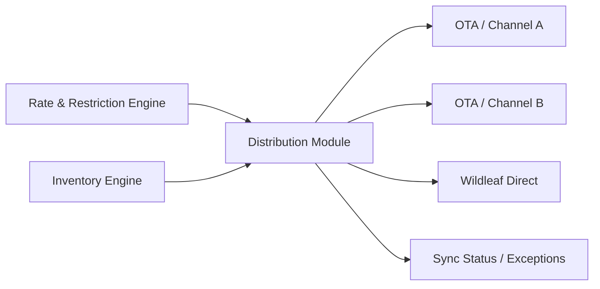

# Distribution and Revenue Architecture

## 1. Principle

Wildleaf should become the central commercial source for rates, restrictions and sellable inventory even when reservations arrive through external channels.

The first V2 release does not need every OTA integration, but the data model must make them natural additions rather than future rewrites.

## 2. Channel model

Entities include:

- channel/provider;
- property channel account;
- room-type mapping;
- rate-plan mapping;
- tax/fee mapping;
- cancellation-policy mapping;
- sync job/event;
- external reservation mapping.

No provider-specific IDs are embedded as first-class columns throughout core reservation tables.

## 3. Outbound distribution

Conceptual flow:

Outbound updates are versioned and idempotent where provider APIs permit.

## 4. Inbound reservations

An OTA booking is normalized into the canonical reservation model. Import processing must:

- verify provider authenticity;
- map external property/room/rate plan;
- deduplicate by provider reservation ID;
- allocate inventory transactionally;
- persist provider payload/reference;
- surface an overbooking exception if canonical inventory cannot accept it;
- never silently discard the provider booking.

## 5. Revenue management

Revenue management operates on top of the rate engine. It does not bypass it.

Inputs can eventually include:

- occupancy;
- pickup/pace;
- lead time;
- day of week;
- season;
- local events;
- competitor set;
- cancellation/no-show patterns;
- channel demand;
- minimum/maximum rate guardrails.

Outputs are proposed or automatically approved rate-calendar changes depending on property policy.

## 6. Rate governance

Each property can define:

- base rate;
- floor rate;
- ceiling rate;
- weekend rules;
- season rules;
- occupancy pricing;
- extra adult/child charges;
- meal-plan differentials;
- min/max stay;
- CTA/CTD;
- stop sell;
- promotions.

Changes record actor/source and are auditable.

## 7. Central revenue team workflow

Wildleaf revenue managers need:

- portfolio pickup dashboard;
- low/high occupancy alerts;
- pending rate recommendations;
- bulk but controlled rate changes;
- property-level guardrails;
- channel parity/status view;
- event calendar;
- override reason logging.

## 8. Channel reliability

Distribution is eventually consistent by nature. Therefore Wildleaf tracks:

- last successful push/pull;
- expected version;
- provider acknowledgment;
- failures and retries;
- mapping errors;
- stale inventory warning;
- manual reconciliation state.

The guest-direct booking path always uses current canonical inventory even if an OTA is temporarily out of sync.
