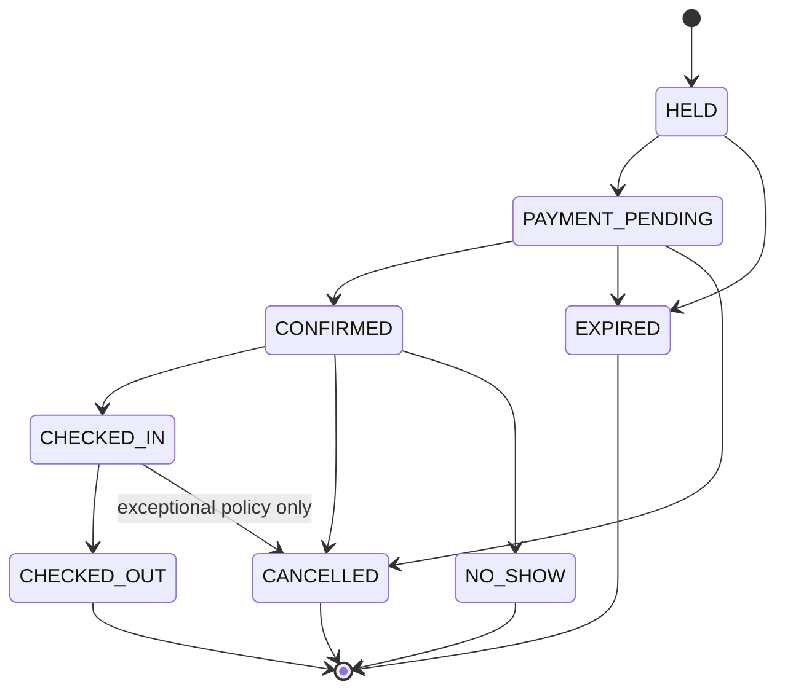

# Reservation Architecture

## 1. Canonical reservation principle

Every booking source creates the same Wildleaf reservation model. Source is metadata, not a different booking system.

Sources may include:

- Wildleaf web;
- Wildleaf call center;
- partner portal;
- front desk / walk-in;
- OTA/channel import;
- travel agent;
- corporate account;
- manual Wildleaf admin entry.

## 2. State machine

Reservation lifecycle is explicit and validated. A proposed core state machine:

A separate quote state precedes hold creation and may expire without creating a reservation.

## 3. State transition rules

Only the reservation domain service may change reservation state. Controllers, payment handlers and admin UI call named commands such as:

- `CreateHold`
- `BeginPayment`
- `ConfirmReservation`
- `CancelReservation`
- `MarkNoShow`
- `CheckInReservation`
- `CheckOutReservation`

Each command validates current state, permissions, policy and idempotency.

## 4. Quote snapshot

A quote contains a complete price explanation:

- room/full-property product;
- nights;
- rate plan;
- occupancy;
- nightly rate lines;
- extra guest charges;
- discounts/promotions;
- taxes;
- fees;
- total;
- cancellation policy snapshot;
- expiry;
- currency.

The reservation references/copies the accepted quote. Later rate changes do not rewrite historical booking economics.

## 5. Guest allocation

For room bookings, guest occupancy is allocated per reservation item. Validation covers:

- adults;
- children by age policy;
- infants;
- max occupancy;
- included occupancy;
- extra-person pricing;
- room quantity.

Property-level adults/kids search filters are only discovery inputs; final allocation must be explicit before booking confirmation.

## 6. Confirmation code

Guests receive a human-friendly confirmation code distinct from the database ID. Codes are unique and non-sequential enough to avoid easy enumeration.

## 7. Cancellation

Cancellation is never a bare unauthenticated `bookingId` endpoint.

Allowed paths:

- authenticated guest self-service;
- secure guest verification flow;
- property role with permission;
- Wildleaf support/admin with reason;
- channel-originated cancellation verified through integration.

Cancellation performs a transaction that:

1. validates state and actor;
2. computes policy/refund outcome;
3. changes reservation state;
4. releases relevant inventory exactly once;
5. emits financial/refund work if required;
6. appends status history and audit event;
7. queues notifications.

## 8. Amendments

Date/room/guest changes are explicit amendments. We do not directly overwrite a confirmed reservation and hope inventory remains correct.

A safe amendment process:

1. calculate target quote/inventory;
2. lock old and new required inventory in stable order;
3. allocate new inventory before releasing old where necessary;
4. calculate financial difference;
5. commit amendment record + reservation changes atomically;
6. trigger additional payment/refund as needed.

## 9. Check-in and checkout

Operational lifecycle is part of the canonical reservation. Check-in may require:

- guest identity/compliance completion;
- payment/deposit conditions;
- assigned physical unit;
- property readiness.

Check-out can close operational tasks and trigger final settlement/review workflows.

## 10. Status history

Every lifecycle transition creates an immutable `reservation_status_history` entry with actor/source/reason. Current state is stored for efficient reads, while history explains how it was reached.
