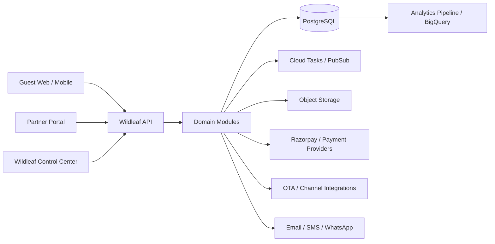

# System Architecture

## 1. Architectural style

Wildleaf V2 will begin as a **modular monolith** with strict domain boundaries, deployed as containerized services. This gives Wildleaf transactional consistency and operational simplicity while preserving the option to split high-load domains into services later.

The platform will use Google Cloud as the primary infrastructure family because the current system already uses Firebase and Google Cloud. The chosen architecture deliberately avoids making Firestore the transactional system of record for inventory, reservations and financial accounting.

## 2. Core technology direction

### Transactional core

- PostgreSQL as the authoritative operational database.
- Managed PostgreSQL on Google Cloud SQL for production and staging.
- Explicit SQL transactions for inventory, reservations, payments and settlement state transitions.
- Connection pooling and bounded transaction durations.

### Application runtime

- TypeScript in strict mode.
- Containerized Node.js backend on Cloud Run.
- Versioned REST APIs with OpenAPI contracts.
- Domain modules with application services, repositories and policy objects.

### Identity and media

- Firebase Authentication may continue as the identity provider.
- Google Cloud Storage / Firebase Storage for photos and documents.
- Secret Manager for secrets.

### Asynchronous work

- Cloud Tasks for scheduled/retryable single jobs such as hold expiry and notification delivery.
- Pub/Sub for domain-event fan-out where asynchronous consumers are appropriate.
- Redis/Memorystore only for cache, locks that are explicitly non-authoritative, rate limiting and ephemeral data. Redis must never be the only source of reservation or inventory truth.

### Observability

- structured JSON logs;
- request/correlation IDs;
- distributed trace propagation;
- error reporting;
- metrics for booking conversion, payment failures, inventory conflicts and integration lag.

### Analytics

- operational PostgreSQL remains optimized for correctness;
- event/CDC pipelines can feed BigQuery later;
- dashboards must not run heavy analytical scans directly against production booking tables.

## 3. Product surfaces

Wildleaf has three primary applications, all using the same backend domain engine.

### Guest marketplace

Responsible for discovery, property content, availability search, pricing, checkout, guest self-service and post-stay interactions. It has no direct write access to operational storage.

### Partner portal

Used by hotel owners and authorized property staff. It exposes property-scoped operations such as rates, inventory, bookings, property content, operational tasks, statements and support.

### Wildleaf control center

Used by Wildleaf corporate users. It provides cross-property operations, approvals, quality management, revenue management, support, finance and audit visibility.

## 4. Domain modules

The initial modular monolith contains the following bounded modules:

1. Identity & Access
2. Organizations & Memberships
3. Property Onboarding & Compliance
4. Property Catalog
5. Units & Room Types
6. Inventory
7. Rates & Restrictions
8. Availability & Pricing
9. Reservations
10. Payments & Refunds
11. Financial Ledger
12. Owner Settlements
13. Distribution & Channels
14. Guest CRM
15. Operations & Service Desk
16. Quality & Audits
17. Reviews & Resolutions
18. Notifications
19. Audit & Activity
20. Reporting Read Models

Each module owns its invariants. Other modules interact through application interfaces or domain events, not ad-hoc table updates.

## 5. API boundaries

We will expose logical API surfaces even if they are hosted by one backend initially:

- `/v1/public/*` — anonymous/guest-facing operations
- `/v1/guest/*` — authenticated guest self-service
- `/v1/partner/*` — property partner operations
- `/v1/admin/*` — Wildleaf staff operations
- `/v1/webhooks/*` — verified provider callbacks
- `/v1/internal/*` — protected internal service endpoints if later required

Every mutation accepts or derives:

- actor identity;
- tenant/property scope;
- correlation ID;
- idempotency key where appropriate;
- reason/source metadata for sensitive operations.

## 6. Scalability model

The architecture is designed to scale horizontally at the API layer while keeping correctness in PostgreSQL transactions. We will not prematurely split into microservices. A module is a candidate for extraction only when at least one of these becomes true:

- independent scaling is materially required;
- independent release cadence is required;
- database workload isolation is required;
- compliance or security isolation is required;
- team ownership makes a separate service materially safer.

Expected early extraction candidates, if needed later, are distribution/channel sync, notifications and analytics ingestion—not reservations or inventory by default.

## 7. Availability versus consistency

For booking and payments, correctness wins over accepting an invalid reservation. If an inventory transaction cannot safely obtain the required database locks or a payment state is ambiguous, the system returns a retriable or pending state rather than guessing.

Guest search may use cached or precomputed read models, but final quote and hold creation always revalidate against authoritative transactional data.

## 8. Failure design

Every external integration is assumed to fail, retry, duplicate callbacks or arrive out of order. Therefore:

- webhook handling is idempotent;
- provider events are persisted before business processing;
- retries use exponential backoff;
- poison events go to a dead-letter/review path;
- manual reconciliation tools exist for finance/operations;
- user-facing success is only shown after authoritative confirmation.

## 9. Legacy coexistence

The existing Firebase prototype remains unchanged while V2 is built. New V2 modules must not import legacy Firestore collections as their domain model. Migration is a deliberate one-way process described in `MIGRATION_STRATEGY.md`.
